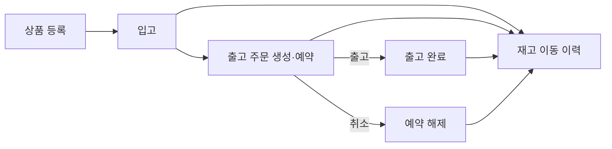
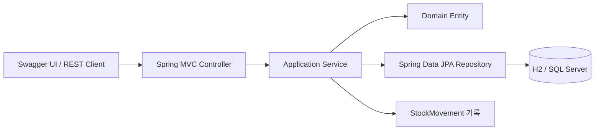

# LogiOps

LogiOps는 단일 물류 거점의 상품, 재고, 출고 주문과 재고 이동 이력을 관리하는 Spring Boot REST API이다. 기능 수를 늘리기보다 재고 정합성, 트랜잭션 경계, 동시성 제어와 실제 DB 검증을 설명 가능한 규모로 구현했다.

## 핵심 구현

- 상품 등록 시 SKU를 정규화하고 상품별 0 재고를 같은 트랜잭션에서 생성한다.
- 입고, 예약, 출고, 취소를 현재재고·예약재고·가용재고 규칙에 따라 처리한다.
- 주문 상태와 재고, 이동 이력을 하나의 트랜잭션에서 변경한다.
- 재고와 주문에 비관적 쓰기 잠금을 적용하고 복수 상품은 상품 ID 오름차순으로 잠근다.
- 모든 재고 변경을 append-only 이동 이력으로 추적한다.
- `ProblemDetail` 기반 오류 계약과 OpenAPI 문서를 제공한다.
- H2 회귀 테스트와 x86-64 SQL Server 2022 호환성 테스트를 구분해 실행한다.

## 업무 흐름과 재고 규칙



- 가용재고 = 현재재고 - 예약재고
- 입고: 현재재고 증가
- 주문 생성: 예약재고 증가
- 출고 완료: 현재재고와 예약재고가 함께 감소
- 주문 취소: 현재재고는 유지하고 예약재고 감소
- `RESERVED` 주문만 `SHIPPED` 또는 `CANCELLED`로 전이 가능

복수 상품 주문은 모든 상품의 가용재고를 먼저 검증한 뒤 일괄 반영한다. 한 항목이라도 실패하면 주문, 재고와 이동 이력 전체를 롤백한다.

## 아키텍처



기능 중심 패키지를 사용하는 소규모 모놀리스이다.

```text
io.github.krapnuyij.logiops
├── common
├── product
├── inventory
└── order
```

`common`은 기능 패키지를 참조하지 않는다. `inventory → product`, `order → product·inventory` 방향만 허용한다. StockMovement는 OutboundOrder Entity 대신 주문 ID를 저장해 `inventory → order` 역방향 의존을 만들지 않는다.

## 동시성 및 트랜잭션 전략

- 재고 변경 전에 `PESSIMISTIC_WRITE`로 Inventory 행을 잠근다.
- 출고와 취소는 OutboundOrder 행을 먼저 잠가 동일 주문의 최종 처리를 직렬화한다.
- 복수 Inventory 행은 상품 ID 오름차순으로 잠가 교착상태 가능성을 줄인다.
- 잠금 획득 후 가용재고를 검사해 초과 예약을 차단한다.
- 애플리케이션 검증과 DB `UNIQUE`, `CHECK`, FK 제약을 함께 사용한다.

H2에서는 애플리케이션 로직과 기본 경쟁 흐름을 검증하고, MSSQL 잠금 동작의 근거로 사용하지 않는다. SQL Server 2022에서는 초과 동시 예약, 출고·취소 경쟁과 역순 다중 상품 주문을 별도로 검증했다.

## H2와 MSSQL에서 확인한 차이

Stage 9의 실제 MSSQL 검증에서 H2만으로 발견하지 못한 다음 문제를 확인하고 수정했다.

1. V5에서 새 컬럼을 추가한 batch 안에서 바로 FK·CHECK·인덱스가 참조해 `Invalid column name`이 발생했다. SQL Server의 DDL batch 경계를 `GO`로 분리했다.
2. Hibernate SQL Server dialect는 `Instant`를 `DATETIMEOFFSET(7)`로 검증하지만 초기 migration은 `DATETIME2(6)`를 사용했다. MSSQL 시간 컬럼을 dialect 기대 타입에 맞췄다.
3. Linux에서 시스템 Clock과 DB 저장 정밀도 차이로 저장 전후 `Instant`가 달라졌다. 공통 UTC Clock의 마이크로초 미만 자릿수를 생성 시점에 0으로 고정했다.

DB별 migration은 같은 버전과 업무 제약을 유지하되 H2와 MSSQL의 타입·문법 차이를 각 디렉터리에서 명시적으로 관리한다.

## 기술 스택

| 구분 | 기술 |
|---|---|
| 언어·런타임 | Java 21 |
| 애플리케이션 | Spring Boot 4.1.1, Spring Web MVC |
| 영속성 | Spring Data JPA, Hibernate, Flyway |
| 데이터베이스 | H2, Microsoft SQL Server 2022 |
| API | Bean Validation, springdoc-openapi 3.1.1, Actuator |
| 테스트 | JUnit 5, AssertJ, Mockito, MockMvc |
| 실행·검증 | Gradle Wrapper 8.14.3, Docker, Docker Compose, GitHub Actions |

## 테스트 근거

| 환경 | 확인한 내용 |
|---|---|
| H2 | 도메인, Repository, API, 트랜잭션, migration과 기본 동시성 회귀 테스트 107건 |
| SQL Server 2022 | 빈 DB Flyway V1~V5, JPA validation, Unicode·시간·IDENTITY 매핑, 핵심 업무 흐름, DB 제약과 비관적 잠금 경쟁 |
| Docker | linux/arm64 이미지 빌드, 비루트 실행, healthcheck, OpenAPI·Swagger UI와 기본 API |

최종 x86-64 MSSQL 검증은 main 브랜치의 GitHub Actions 실행 [36712963102](https://github.com/krapnuyij/logiops/actions/runs/36712963102)에서 성공했다. H2 결과와 MSSQL 결과는 서로 대체하지 않는다.

일반 회귀 테스트를 실행한다.

```bash
./gradlew clean check --no-daemon
```

MSSQL 테스트는 별도 `mssqlTest` task로 분리되어 있으며 준비된 SQL Server 접속정보가 있을 때만 실행한다.

## 로컬 실행

### 요구사항

- JDK 21

별도의 시스템 Gradle 설치 없이 저장소의 Gradle Wrapper를 사용한다.

```bash
./gradlew bootRun --args='--spring.profiles.active=local'
```

호스트의 8080 포트를 다른 프로세스가 사용 중이면 실행 포트를 재정의한다.

```bash
./gradlew bootRun --args='--spring.profiles.active=local --server.port=18081'
```

local 프로필은 인메모리 H2를 사용한다. 애플리케이션 시작 시 Flyway V1~V5를 적용하고 Hibernate가 Entity와 스키마를 검증하며, 종료하면 데이터가 사라진다.

- Health: <http://localhost:8080/actuator/health>
- OpenAPI JSON: <http://localhost:8080/v3/api-docs>
- Swagger UI: <http://localhost:8080/swagger-ui/index.html>

## Docker 실행

Docker 이미지 빌드와 컨테이너 기동을 함께 수행한다.

```bash
docker compose up --build --detach
docker compose ps
```

기본 호스트 포트는 `18080`이고 컨테이너 내부 포트는 `8080`이다.

- Health: <http://localhost:18080/actuator/health>
- OpenAPI JSON: <http://localhost:18080/v3/api-docs>
- Swagger UI: <http://localhost:18080/swagger-ui/index.html>

호스트 포트를 바꾸려면 `LOGIOPS_PORT`를 지정한다.

```bash
LOGIOPS_PORT=19090 docker compose up --build --detach
```

검증을 마치면 LogiOps 컨테이너와 전용 네트워크만 종료한다.

```bash
docker compose down
```

이미지는 멀티스테이지로 빌드하며 최종 JRE 이미지에는 실행 JAR만 포함한다. 컨테이너는 비루트 사용자로 실행하고 Actuator health를 Docker `HEALTHCHECK`에 사용한다.

## API 실행 예시

다음 예시는 새 local 프로필 DB에서 순서대로 실행한다고 가정한다. 기존 데이터가 있다면 응답의 상품·주문 ID로 경로를 바꿔야 한다.

상품을 등록하고 20개를 입고한다.

```bash
curl -i \
  -H 'Content-Type: application/json' \
  -d '{"sku":"sku-001","name":"테스트 상품"}' \
  http://localhost:8080/api/v1/products

curl -X POST \
  -H 'Content-Type: application/json' \
  -d '{"quantity":20}' \
  http://localhost:8080/api/v1/inventories/1/receipts
```

4개를 예약한 첫 주문을 생성하고 출고한다.

```bash
curl -i \
  -H 'Content-Type: application/json' \
  -d '{"items":[{"productId":1,"quantity":4}]}' \
  http://localhost:8080/api/v1/outbound-orders

curl -X POST http://localhost:8080/api/v1/outbound-orders/1/ship
```

3개를 예약한 두 번째 주문을 생성하고 취소한다.

```bash
curl -i \
  -H 'Content-Type: application/json' \
  -d '{"items":[{"productId":1,"quantity":3}]}' \
  http://localhost:8080/api/v1/outbound-orders

curl -X POST http://localhost:8080/api/v1/outbound-orders/2/cancel
```

최종 재고와 주문별 이동 이력을 확인한다.

```bash
curl http://localhost:8080/api/v1/inventories/1
curl 'http://localhost:8080/api/v1/stock-movements?orderId=1&type=SHIPMENT'
curl 'http://localhost:8080/api/v1/stock-movements?orderId=2&type=RESERVATION_RELEASE'
```

상세 요청·응답과 오류 코드는 [API 명세](docs/API_SPEC.md)를 참고한다.

## MSSQL 검증 방법

공식 검증 경로는 Microsoft가 지원하는 x86-64 Linux GitHub Actions runner와 SQL Server 2022 서비스 컨테이너이다. Apple Silicon 로컬 에뮬레이션은 Microsoft가 테스트하거나 지원하는 구성이 아니므로 공식 결과로 사용하지 않는다.

외부 MSSQL을 직접 사용할 때는 실제 값을 저장소에 기록하지 않고 환경변수로 주입한다.

```bash
export MSSQL_URL='jdbc:sqlserver://HOST:1433;databaseName=logiops;encrypt=true;trustServerCertificate=true'
export MSSQL_USERNAME='sa'
export MSSQL_PASSWORD='직접 설정한 비밀번호'
./gradlew mssqlTest --no-daemon
```

GitHub Actions는 `MSSQL_SA_PASSWORD` repository secret을 사용한다. 비밀번호는 저장소 파일이나 로그에 기록하지 않는다.

## API 오류 계약

오류는 Spring `ProblemDetail`을 확장한 JSON으로 반환하며 `errorCode`를 포함한다.

```json
{
  "type": "about:blank",
  "title": "Conflict",
  "status": 409,
  "detail": "상품 SKU-001의 가용재고가 부족합니다.",
  "instance": "/api/v1/outbound-orders",
  "errorCode": "INSUFFICIENT_STOCK"
}
```

- 요청 검증: 400
- 리소스 없음: 404
- 재고 부족·SKU 중복·상태 충돌: 409
- 예상하지 못한 내부 오류: 안전한 고정 메시지의 500

내부 예외 메시지, SQL과 스택 추적은 응답에 노출하지 않는다.

## 범위와 한계

MVP는 단일 논리 창고와 정수 수량, 전체 출고·전체 취소만 지원한다. 별도 프론트엔드, 인증·인가, 멀티테넌트, 부분 출고, 반품, 재고 조정과 외부 물류 API는 구현하지 않았다.

인증 기능이 없으므로 신뢰할 수 없는 공용 네트워크에 배포하는 운영 서비스로 사용해서는 안 된다. 향후 확장 후보는 창고·로케이션별 재고, 부분 출고와 백오더, 멱등성 키, 감사 사용자와 외부 WMS 연동이다.

## 문서

- [프로젝트 명세](PROJECT_SPEC.md)
- [아키텍처](docs/ARCHITECTURE.md)
- [도메인 모델](docs/DOMAIN_MODEL.md)
- [API 명세](docs/API_SPEC.md)
- [테스트 전략](docs/TEST_STRATEGY.md)
- [주요 의사결정](docs/DECISIONS.md)
- [개발 로드맵](docs/ROADMAP.md)
- [현재 단계와 검증 기록](CURRENT_STAGE.md)
