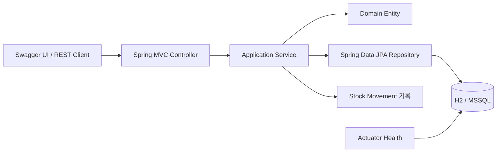

# 아키텍처

## 1. 목표

LogiOps는 하나의 Spring Boot 애플리케이션과 하나의 관계형 데이터베이스로 구성하는 모듈형 모놀리스이다. 목표는 다음과 같다.

- 작은 코드베이스에서 업무 흐름과 트랜잭션 경계를 명확히 보여준다.
- 주문과 재고를 한 DB 트랜잭션으로 처리한다.
- 기능 중심 패키지로 변경 영향 범위를 찾기 쉽게 한다.
- H2로 빠르게 개발하되 MSSQL에서 별도로 호환성을 검증한다.
- 향후 확장 가능성 때문에 현재 구조를 과도하게 복잡하게 만들지 않는다.

## 2. 시스템 구성



MVP에는 별도 프론트엔드, 메시지 브로커, 캐시, 외부 API가 없다.

## 3. 기술 기준

| 구분 | 선택 |
|---|---|
| 런타임 | Java 21 |
| 애플리케이션 | Spring Boot 4.1.1 |
| 빌드 | Gradle Wrapper 8.14.3, Groovy DSL |
| 웹 | Spring Web MVC |
| 영속성 | Spring Data JPA |
| 검증 | Jakarta Bean Validation |
| 개발·테스트 DB | H2 |
| 스키마 변경 | Flyway, Stage 2부터 |
| API 문서 | springdoc-openapi-starter-webmvc-ui 3.1.1 |
| 상태 확인 | Spring Boot Actuator |
| 최종 호환성 DB | MSSQL |

Spring Boot 4.1.1은 Java 17 이상과 Gradle 8.14 이상 또는 9.x를 지원한다. Java 21과 Gradle 8.14.3은 이 범위 안에 있다. JDBC와 Flyway 관련 의존성은 Spring Boot BOM 관리 버전을 우선한다.

- [Spring Boot 시스템 요구사항](https://docs.spring.io/spring-boot/system-requirements.html)
- [Gradle 8.14.3 릴리스 노트](https://docs.gradle.org/8.14.3/release-notes.html)
- [springdoc-openapi](https://github.com/springdoc/springdoc-openapi)

## 4. 패키지 구조

루트 패키지는 `io.github.krapnuyij.logiops`이다.

```text
io.github.krapnuyij.logiops
├── LogiOpsApplication
├── common
│   ├── config
│   └── error
├── product
│   └── dto
├── inventory
│   └── dto
└── order
    └── dto
```

기능 패키지 내부에서는 다음 역할을 사용한다.

- `Controller`: HTTP 요청 검증, Service 호출, HTTP 응답 변환
- `Service`: 유스케이스 조정과 트랜잭션 경계
- `Entity`: 상태와 도메인 불변식 보호
- `Repository`: JPA 조회와 잠금
- `dto`: API 요청·응답 모델

작은 프로젝트이므로 기능마다 `api/application/domain/infrastructure` 하위 계층을 추가하지 않는다. 코드가 증가해 단일 패키지 탐색이 어려워질 때만 재검토한다.

## 5. 의존 방향

- `common`은 다른 기능에 의존하지 않는다.
- `inventory`는 상품 식별과 연관관계를 위해 `product`에 의존할 수 있다.
- `order`는 주문 처리 중 `product`와 `inventory`를 사용한다.
- Controller는 Repository를 직접 호출하지 않는다.
- Entity는 Controller나 DTO를 참조하지 않는다.
- 기능 간 트랜잭션이 필요한 경우 Service가 관련 Repository와 Entity를 조정한다.

엄격한 독립 모듈이나 포트·어댑터 계층은 MVP에 도입하지 않는다. 패키지 간 순환 의존이 실제로 발생하면 추상화를 먼저 추가하지 않고 책임 배치를 재검토한다.

Stage 3 상품 등록에서는 `product` 패키지에 `ProductInventoryInitializer` 인터페이스를 두고 `inventory` 패키지의 `DefaultProductInventoryInitializer`가 구현한다. 이 작은 의존 역전을 통해 `ProductService`가 재고 구현을 직접 참조하지 않으면서 상품과 0 재고를 같은 트랜잭션에서 생성하고, 컴파일 의존 방향을 `inventory → product`로 유지한다.

Stage 4의 `StockMovement`는 `OutboundOrder` Entity를 참조하지 않고 nullable 주문 ID만 저장한다. DB FK는 유지하되 Java 의존 방향은 `order → inventory`로 제한해 `inventory ↔ order` 순환 의존을 방지한다.

## 6. 트랜잭션 경계

### 상품 등록

- Stage 2에서 생성된 기존 상품의 0 재고 행은 Stage 3 마이그레이션으로 생성한다.
- Stage 3 이후 신규 상품 등록은 상품과 0 재고 행을 같은 트랜잭션에서 생성한다.

### 입고

한 트랜잭션에서 다음 작업을 처리한다.

1. 상품별 Inventory 조회 및 잠금
2. 현재재고 증가
3. `RECEIPT` 이동 이력 저장

### 주문 생성

한 트랜잭션에서 다음 작업을 처리한다.

1. 요청 항목 중복과 수량 검증
2. 상품 ID 오름차순 정렬
3. 관련 Inventory 행 잠금
4. 모든 상품의 가용재고 검증
5. 주문과 주문 항목 저장
6. 예약재고 증가
7. 상품별 `RESERVATION` 이력 저장

중간 단계에서 하나라도 실패하면 전체 작업을 롤백한다.

주문 항목은 상품 ID 오름차순으로 정렬하고 기존 Inventory 잠금 조회를 순서대로 호출한다. 응답 항목도 같은 순서로 반환하며 요청 순서 자체에는 업무 의미를 두지 않는다.

### 출고 완료와 주문 취소

한 트랜잭션에서 다음 작업을 처리한다.

1. OutboundOrder 루트 행 잠금
2. 주문 존재 여부와 `RESERVED` 상태 검증
3. 주문 항목을 상품 ID 오름차순으로 정렬
4. 관련 Inventory 행을 같은 순서로 잠금
5. 모든 항목의 예약재고 선검증
6. 하나의 처리 시각 생성
7. 주문 상태와 처리 시각 변경
8. 모든 재고 변경과 `SHIPMENT` 또는 `RESERVATION_RELEASE` 이력 저장
9. 상세 주문 재조회

주문 잠금 쿼리는 컬렉션 fetch join과 분리해 잠금 범위가 불필요하게 넓어지는 것을 피한다. 처리 후에는 트랜잭션 안에서 상세 주문을 다시 조회해 OSIV 없이도 응답 항목과 상품을 읽을 수 있게 한다. 중간 단계에서 하나라도 실패하면 주문 상태, 재고, 이동 이력 전체를 롤백한다.

## 7. 동시성 전략

기본 전략은 DB 비관적 쓰기 잠금이다.

- Inventory 조회에 `PESSIMISTIC_WRITE`를 사용한다.
- 출고·취소 경쟁을 막기 위해 OutboundOrder도 쓰기 잠금으로 조회한다.
- 복수 Inventory는 상품 ID 오름차순으로 잠근다.
- 가용재고 검사는 잠금을 획득한 뒤 수행한다.
- H2에서는 애플리케이션 로직과 기본 동시성 동작을 테스트한다.
- H2의 잠금 동작이 MSSQL과 완전히 같다고 가정하지 않는다.
- Stage 9에서 실제 MSSQL의 비관적 잠금과 트랜잭션 동작을 반드시 다시 테스트한다.
- DB `CHECK`와 `UNIQUE` 제약을 마지막 방어선으로 사용한다.

Stage 3에서는 입고 트랜잭션과 Inventory 잠금을 구현하고 H2 동시 입고를 기본 검증했다. Stage 4와 Stage 5에서는 주문 트랜잭션 경계를 구현했다. Stage 7에서는 입고·예약, 경계·초과 예약, 동일 주문 출고·취소, 복수 상품 역순 요청을 별도 트랜잭션으로 병렬 실행해 H2 기반 회귀 검증을 완료했다. 이 결과는 애플리케이션의 잠금 순서와 정합성 규칙에 대한 근거이며 MSSQL의 잠금 의미나 교착상태 특성이 같다는 근거는 아니다.

## 8. 데이터베이스와 마이그레이션

- Stage 1: 엔티티 없음, Flyway 없음, `ddl-auto=none`
- Stage 2: Flyway 도입, `V1__create_product_table.sql`, `ddl-auto=validate`
- Stage 3: `V2__create_inventory_table.sql`, 기존 상품 재고 backfill, `V3__create_stock_movement_table.sql`
- Stage 4: `V4__create_outbound_order_tables.sql`, `V5__link_stock_movements_to_outbound_orders.sql`
- Stage 5: V3~V5에 상태·처리 시각·이동 유형·주문 참조 제약이 이미 포함되어 새 마이그레이션 없음
- Stage 6 이후: 스키마 변경이 필요한 경우에만 순차 마이그레이션 추가
- 테스트: H2 테스트 DB에 `db/migration/h2`의 실제 Flyway 마이그레이션 적용
- Stage 9: MSSQL에는 `db/migration/mssql`의 vendor 전용 마이그레이션 적용

Stage 9에서 IDENTITY와 시간·문자열 타입의 실제 차이를 확인해 V1~V5를 H2와 MSSQL 디렉터리로 분리했다. MSSQL 스크립트는 `IDENTITY(1,1)`, `DATETIME2(6)`, `NVARCHAR`를 사용한다. 두 DB는 같은 버전과 제약 이름·업무 규칙을 유지하며 변경 시 함께 갱신한다. 빈 MSSQL DB 적용과 Hibernate validation은 x86-64 GitHub Actions 실행 후 완료 여부를 기록한다.

## 9. 설정과 프로필

설정 파일은 다음과 같다.

- `application.yml`: 공통 설정
- `application-local.yml`: H2 로컬 실행과 H2 migration 위치
- `application-test.yml`: H2 테스트 격리와 H2 migration 위치
- `application-mssql.yml`: 환경변수 기반 MSSQL 접속, MSSQL migration 위치, nationalized 문자열 매핑

MSSQL의 DB URL, 사용자명, 비밀번호는 `MSSQL_URL`, `MSSQL_USERNAME`, `MSSQL_PASSWORD` 환경변수로 주입한다. 실제 값은 저장소에 기록하지 않는다. `hibernate.use_nationalized_character_data=true`로 Entity 문자열과 `NVARCHAR` 스키마를 일치시킨다. Open EntityManager in View는 비활성화해 웹 계층의 지연 로딩 의존을 막는다.

애플리케이션의 공통 UTC `Clock`은 마이크로초 단위로 tick한다. H2 `TIMESTAMP`와 MSSQL `DATETIME2(6)`보다 미세한 나노초 값을 생성 단계에서 제거하므로, DB나 드라이버가 초과 정밀도를 반올림하는지 절삭하는지에 의존하지 않고 생성 직후와 재조회 시각을 동일하게 유지한다.

## 10. API와 오류 처리

- 성공 응답은 용도별 DTO를 직접 반환한다.
- 생성 API는 HTTP 201과 `Location` 헤더를 사용한다.
- 오류는 Spring `ProblemDetail`을 확장한 `ApiProblemDetail`과 `errorCode`로 통일한다.
- 필드 단위 검증 오류는 `fieldErrors` 목록을 제공하고 구조화할 필드가 없으면 생략한다.
- `ApiExceptionHandler`는 공통 예외 상위 타입을 400·404·409로 변환하며 기능 패키지를 직접 참조하지 않는다.
- Spring MVC의 `ResponseEntityExceptionHandler`를 확장해 알려진 프레임워크 4xx 처리를 유지하고, 마지막 포괄 처리에서만 예상하지 못한 예외를 500으로 변환한다.
- 예상하지 못한 오류는 서버에 원본 예외를 기록하되 응답에는 고정 코드와 안전한 설명만 제공한다. 내부 예외 메시지, SQL, 예외 클래스, 스택 추적은 노출하지 않는다.
- 주문 항목 수량과 예약재고의 관계가 깨진 경우는 단일 Aggregate 내부 검증이 아닌 Aggregate 간 정합성 오류이므로 500으로 처리한다.
- 각 Controller는 발생 가능한 400·404·409·500 응답과 공통 오류 스키마를 OpenAPI에 명시한다.

세부 계약은 [API 명세](API_SPEC.md)에서 관리한다.

## 11. 관측과 운영 범위

- Stage 1에서는 `/actuator/health`만 외부 노출 대상으로 검증한다.
- 애플리케이션 로그에는 업무 식별자를 포함하되 요청 본문 전체나 민감정보를 기록하지 않는다.
- 메트릭, 분산 추적, 외부 로그 수집은 MVP 이후 확장 후보이다.
- 인증·인가가 없으므로 MVP를 공용 네트워크용 운영 서비스로 간주하지 않는다.

## 12. 배포 구조

Stage 8에서는 Temurin Java 21 기반 멀티스테이지 Dockerfile을 사용한다. JDK 단계에서 Gradle Wrapper로 실행 JAR을 만들고 최종 JRE 이미지에는 `app.jar`만 복사한다. 런타임은 비루트 사용자로 실행하며 Actuator health를 Docker `HEALTHCHECK`로 사용한다.

Compose는 local 프로필의 애플리케이션 컨테이너 하나만 실행한다. 기본 호스트 포트는 18080이고 `LOGIOPS_PORT`로 재정의할 수 있으며, 컨테이너 내부 포트는 8080을 유지한다. 인메모리 H2 데이터는 컨테이너 제거 시 사라진다. MSSQL, 영속 DB 볼륨, 운영용 비밀정보 주입은 Stage 8 구성에 포함하지 않는다.

빌드 컨텍스트에서는 Git·Gradle 캐시, 기존 빌드 산출물, IDE 설정, 문서, 테스트 코드와 `.env` 계열 파일을 제외한다. Kubernetes, 서비스 분리, 무중단 배포는 범위 밖이다.

Stage 9 MSSQL 검증은 GitHub Actions `ubuntu-24.04` x86-64 runner와 `mcr.microsoft.com/mssql/server:2022-latest` 서비스 컨테이너를 사용한다. 일반 H2 테스트와 `mssql` JUnit tag의 전용 테스트를 분리하며, CI에서 둘을 순서대로 실행한다. Microsoft JDBC와 Flyway SQL Server 모듈은 Spring Boot BOM 관리 버전을 사용한다. 실제 MSSQL 결과는 워크플로를 실행한 뒤 기록한다.
