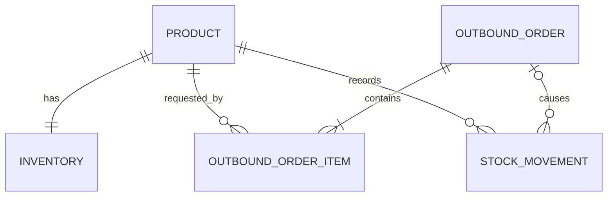
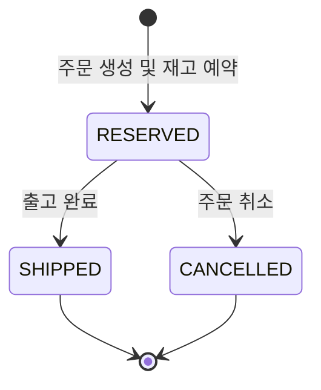

# 도메인 모델

## 1. 용어

| 한글 용어 | 코드 용어 | 의미 |
|---|---|---|
| 상품 | `Product` | SKU로 식별되는 재고 관리 대상 |
| 현재재고 | `onHandQuantity` | 물리적으로 보유한 총수량 |
| 예약재고 | `reservedQuantity` | 출고 주문에 할당됐지만 아직 출고되지 않은 수량 |
| 가용재고 | `availableQuantity` | 새 주문에 예약할 수 있는 수량 |
| 출고 주문 | `OutboundOrder` | 하나 이상의 상품 출고 요청 |
| 주문 항목 | `OutboundOrderItem` | 상품과 요청 수량의 조합 |
| 재고 이동 | `StockMovement` | 재고 수치가 변경된 원인과 결과 기록 |

가용재고는 다음 식으로 계산한다.

```text
availableQuantity = onHandQuantity - reservedQuantity
```

## 2. 관계



## 3. Product

### 책임

- 상품의 고유 SKU와 이름을 보관한다.
- SKU와 이름의 기본 유효성을 유지한다.

### 속성

| 속성 | 형식 | 규칙 |
|---|---|---|
| `id` | `Long` | DB 생성 식별자 |
| `sku` | `String` | `strip()` 후 `^[A-Za-z0-9._-]{1,64}$`, `Locale.ROOT` 기준 대문자 정규화, 시스템 전체에서 유일 |
| `name` | `String` | `strip()` 후 1~100자, 별도 문자셋 whitelist 없음 |
| `createdAt` | `Instant` | 생성 시각 |

SKU는 정규화된 값만 저장하고 응답하며 생성 후 변경하지 않는다. 상품 수정과 삭제는 MVP 범위 밖이다.

## 4. Inventory

### 책임

- 상품의 현재재고와 예약재고를 관리한다.
- 입고, 예약, 출고, 예약 해제 연산에서 불변식을 보호한다.

### 속성

| 속성 | 형식 | 규칙 |
|---|---|---|
| `id` | `Long` | DB 생성 식별자 |
| `product` | `Product` | 필수, 상품당 하나, unique FK |
| `onHandQuantity` | `long` | 0 이상 |
| `reservedQuantity` | `long` | 0 이상, 현재재고 이하 |
| `updatedAt` | `Instant` | 최종 변경 시각 |

`availableQuantity`는 영속 필드가 아니며 조회 시 계산한다.

### 연산

| 연산 | 사전 조건 | 현재재고 | 예약재고 |
|---|---|---:|---:|
| `receive(q)` | `q > 0` | `+q` | 변화 없음 |
| `reserve(q)` | `q > 0`, 가용재고 `>= q` | 변화 없음 | `+q` |
| `ship(q)` | `q > 0`, 예약재고 `>= q` | `-q` | `-q` |
| `release(q)` | `q > 0`, 예약재고 `>= q` | 변화 없음 | `-q` |

모든 연산 후 다음 조건을 만족해야 한다.

```text
onHandQuantity >= 0
reservedQuantity >= 0
onHandQuantity >= reservedQuantity
```

## 5. OutboundOrder

### 책임

- 주문 항목과 상태를 관리한다.
- 출고와 취소 상태 전이를 보호한다.

### 속성

| 속성 | 형식 | 규칙 |
|---|---|---|
| `id` | `Long` | DB 생성 식별자 |
| `status` | `OutboundOrderStatus` | `RESERVED`, `SHIPPED`, `CANCELLED` |
| `items` | `List<OutboundOrderItem>` | 최소 1개 |
| `createdAt` | `Instant` | 주문 생성 시각 |
| `shippedAt` | `Instant?` | 출고 완료 시 설정 |
| `cancelledAt` | `Instant?` | 취소 시 설정 |

주문 생성과 재고 예약은 분리되지 않는다. 따라서 생성된 주문의 최초 상태는 `RESERVED`이다.

## 6. OutboundOrderItem

| 속성 | 형식 | 규칙 |
|---|---|---|
| `id` | `Long` | DB 생성 식별자 |
| `outboundOrder` | `OutboundOrder` | 필수 FK |
| `product` | `Product` | 필수 FK |
| `quantity` | `long` | 양의 정수 |

한 주문에서 같은 상품을 두 번 지정할 수 없다. 애플리케이션 검증과 `(outbound_order_id, product_id)` unique 제약을 함께 사용한다.

## 7. 주문 상태 전이



| 현재 상태 | 명령 | 결과 상태 | 허용 여부 |
|---|---|---|---|
| `RESERVED` | 출고 완료 | `SHIPPED` | 허용 |
| `RESERVED` | 취소 | `CANCELLED` | 허용 |
| `SHIPPED` | 출고 완료 또는 취소 | 변화 없음 | HTTP 409 |
| `CANCELLED` | 출고 완료 또는 취소 | 변화 없음 | HTTP 409 |

부분 출고와 부분 취소는 지원하지 않는다.

## 8. StockMovement

### 책임

- 재고가 변경된 원인, 변화량, 변경 후 잔액을 추적한다.
- 운영 조회와 트랜잭션 검증 근거를 제공한다.

### 속성

| 속성 | 형식 | 규칙 |
|---|---|---|
| `id` | `Long` | DB 생성 식별자 |
| `product` | `Product` | 필수 FK |
| `outboundOrderId` | `Long?` | 입고는 null, 주문 관련 이동은 필수, DB FK |
| `type` | `StockMovementType` | 이동 유형 |
| `onHandDelta` | `long` | 현재재고 변화량 |
| `reservedDelta` | `long` | 예약재고 변화량 |
| `onHandAfter` | `long` | 처리 후 현재재고 |
| `reservedAfter` | `long` | 처리 후 예약재고 |
| `occurredAt` | `Instant` | 발생 시각 |

### 이동 유형

| 유형 | 현재재고 변화 | 예약재고 변화 | 원인 |
|---|---:|---:|---|
| `RECEIPT` | `+q` | 0 | 입고 |
| `RESERVATION` | 0 | `+q` | 주문 생성 |
| `SHIPMENT` | `-q` | `-q` | 출고 완료 |
| `RESERVATION_RELEASE` | 0 | `-q` | 주문 취소 |

이력은 append-only이다. 정정이 필요하면 기존 이력을 수정하는 대신 향후 별도 보정 이동 유형을 도입한다. 보정 기능은 MVP 범위 밖이다.

`StockMovement`는 패키지 순환 의존을 피하기 위해 `OutboundOrder` Entity 대신 식별자만 보관한다. Java 객체 연관관계는 두지 않지만 DB FK로 주문 참조 무결성을 보장한다.

## 9. 업무 흐름별 예시

초기 재고가 0인 상품에 10개를 입고하고 4개를 주문한 뒤 출고하면 다음과 같다.

| 단계 | 현재재고 | 예약재고 | 가용재고 |
|---|---:|---:|---:|
| 초기 | 0 | 0 | 0 |
| 10개 입고 | 10 | 0 | 10 |
| 4개 주문 예약 | 10 | 4 | 6 |
| 4개 출고 완료 | 6 | 0 | 6 |

예약 후 주문을 취소하면 현재재고 10, 예약재고 0, 가용재고 10으로 돌아간다.

## 10. 동시성 불변식

- 같은 Inventory를 변경하는 요청은 DB 쓰기 잠금을 획득한 뒤 상태를 검사한다.
- 여러 Inventory를 다룰 때 상품 ID 오름차순으로 잠근다.
- 동일 주문에 대한 출고와 취소는 주문 행 잠금으로 직렬화한다.
- 재고 부족 판단은 트랜잭션 시작 전 조회값이 아니라 잠금 획득 후 값을 사용한다.
- DB 제약조건은 잠금 구현 오류가 음수 재고로 이어지는 것을 막는 최종 방어선이다.
